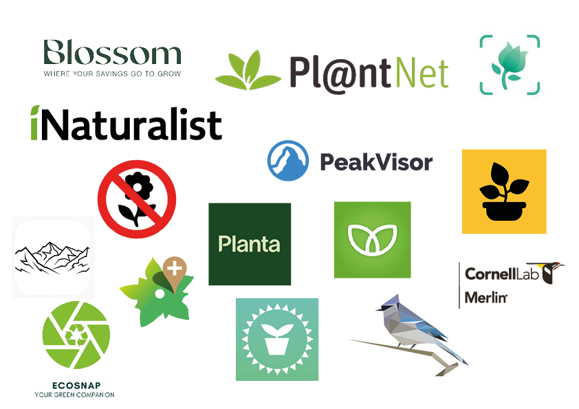

# DATA 

<h1> Applications </h1>

  - Happy plants : (identification sur la plante a besoin d’eau)
 - WaterBots : (identification sur la plante a besoin d’eau)
 - Planta : (Permet de découvrirez les soins adaptés aux végétaux)
 - Growww : (Explique quand semer ou repiquer, et vous rappelle d'arroser les plantes)
 - Picture This : (Identification/ Traitement/ Tips)
 - Blossom : (Identification/ Traitements/ identifications de maladie)
 - PeakVisor : (Identification des montagnes)
 - iNaturalist (identification des plantes et des animaux)
 - BirdNet : (identification des chants des oiseaux)
 - EcoSnap : (Signalez tout problème environnemental rencontrés/Photo pour détailler)
 - InvasivApp
 - FlorApp

<h1>Interviews :</h1>
<h3> Questions : </h3>

 1. Quel âges as-tu ?
 2. Quel est ta profession/ domaine d’étude ?
 3. Quelles applications d’identifications du milieu naturel utilises-tu ?
 4. A quel(s) but(s) utilises-tu ces applications ?
 5. De quelle façon utilises-tu les données collectées ?
 6. Quelle est ta fréquence d’utilisation de ce(s) application(s) ?
 7. Quels changements sur ton quotidien ces applications d’identifications ont permis?
 8. Utilises-tu d’autres outils numériques pour la reconnaissance du milieu naturel ? (ex : jeux vidéos)

<h3>Réponses : </h3>

<h1>Utilisatrice 1</h1> 

 1. 26 ans
 2. Hôtellerie
 3. Blossom
 4. Savoir quand arroser mes plantes et les besoins de chacune , savoir quelles plantes m’entourent
 5. À l’aide des notifications de l’app qui me rappelle quand arroser
 6. J’ai fais 6 mois après j’ai arrêté car c’était payant
 7. Ne pas tuer mes plantes
 8. Non aucun autres outils numériques

<h1>Utilisateur 2</h1>

 1. 25 ans
 2. Agronomie (ensemble des sciences exactes, naturelles, économiques et sociales, et des techniques auxquelles il est fait appel dans la pratique et la compréhension de l'agriculture)
 3. PlantNet
 4. Reconnaissance de plantes quand j'ai des doutes
 5. Pour ma culture générale et mon envie de connaître les plantes mais parfois les données m'aident pour une stratégie de lutte contre les mauvaises herbes par exemple mais c'est rare
 6. 0-15x par mois (fréquence plus élevée au printemps et nulle en hiver)
 7. gros gain de temps, practicité
 8. Non aucun autres outils numériques

Plus : La reconnaissance marche généralement bien mais suivant la qualité de la photo ou le stade de développement de la plante ça ne marche pas tant que cela. (Il donne toujours un pourcentage de certitude et si je connais pas la plante, je me base là dessus si le pourcentage de reconnaissance est ok (>50%).

<h1>Utilisatrice 3</h1>

 1. 47 ans
 2. Cloud & DevOps Deployment Services Manager 
 3. PlantNet
 4. Identifier des plantes, les feuilles des plantes ou fleurs dans le jardin et pour savoir comment les entretenir
 5. Je garde les infos en tête
 6. Environ 1x par semaine et moins en hiver
 7. C'est plus facile que d'aller acheter des livres et chercher dans les livres
 8. Non aucun autres outils numériques

<h1>Utilisateur 4</h1>

 1. 25 ans
 2. Agent d’exploitation
 3. ⁠⁠L’application « PictureThis/InvasivApp/ FlorApp »
 4. Assurer l’identification/ Identifier des Arbres/arbustes/fleures
 5. ⁠⁠J’utilise les données en fonction de mes besoins. (Si maladie sur plante que faire? , époque de floraison, replantation, taille)
 6. 2-3x par semaine
 7. ⁠⁠Gain de temps lors d’identification des sujets
 8. Non aucun autres outils numériques

Plus : L'application PictureThis a permis la guérison d'une plante en apportant les possibilités de maladie. "C’est un gain de temps car normalement si on a une maladie sur une plante, on peut prendre 2-3 feuilles malade et on va chez la Landi et y a des spécialiste du domaine qui nous guide sur la quel maladie ça peut être." 

"Pour mon utilisation que j’en fait c’est juste idéal. J’ai des livres/documents papiers qui peuvent m’aider au quotidien mais le fais de tout avoir sur l’application facilite grandement la recherche et ça m’encombre beaucoup moins sur le terrain."

Inconvénient : "Ce que je vois en utilisant l’application c’est le regard des gens, on travaille habillé tout en orange à la vue de tout le monde souvent quand les gens nous voient sur notre téléphone tout de suite ils se disent « ils font que de rester sur leur téléphone.. » alors qu’en fait c’est aussi un outil de travail. On utilise aussi une application qui s’appelle « InvasivApp » et « FlorApp » pour répertorier les plantes invasives. En utilisant ces app on est beaucoup soit sur notre téléphone soit sur notre tablette."

<h1>Utilisateur 4 :</h1>

 1. 25 ans
 2. Etudiant en ingénierie
 3. PlantNet
 4. Connaître le nom des plantes qui m'entourent
 5. J'en fais rien de plus que lire l'info et parfois chercher la plante sur Wikipedia
 6. 1x par semaine environ
 7. Rien de particulier: je connais pas mieux les plantes. Je les oublie instantanément
 8. Non aucun autres outils numériques

<h1>Résumé</h1>

 - 0 utilisateurs d'identifications pour animaux (ex : Champs des oiseaux)
 - Pour la plupart : utilisation personnelle (arroser ses propres plantes)
 - Ne font rien de particulier ensuite avec ces données (hors travail)
 - Identification par curiosité sur un instant précis (oublis ensuite)
 - Identification pour le travail (guérison et gain de temps)
 - Pas de fiabilité à 100%
 - Pas de réelles initiatives écologiques à grande échelle

<h1>A développer</h1>

 - Observations sur le terrain : (ex : Agent d’exploitation)
 - Entretiens avec des jardiniers/ fleuristes/ Botanistes
 - Examiner d'autres outils numériques pour la reconnaissance du milieu naturel ? 
 