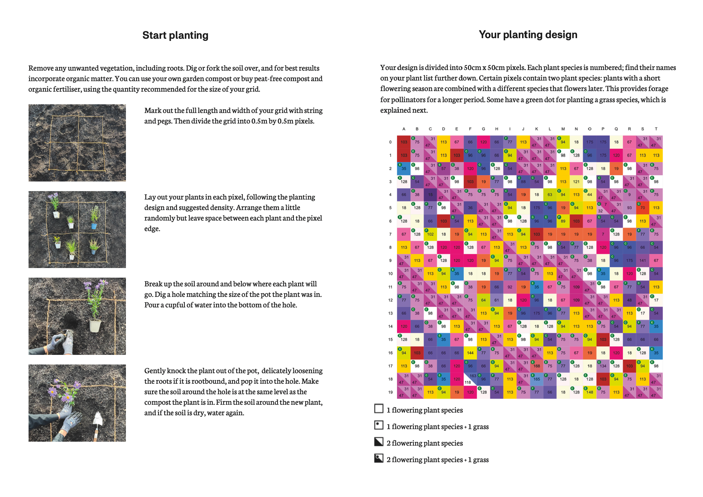

# Master Thesis 2024 - Mindmap

# Inspirations 
https://pollinator.art

## Themes :

 - **Biologie** 
 - **Biomimétism** 
 - **Biotechnologie** 
 - **Biomatérial** 
 - **Générativ design** 
 - **Experimental creation**

## Problématiques (recherches) :

 - Comment les principes du biomimétisme peuvent-ils être utilisés pour optimiser l'efficacité des technologies existantes, et quelles sont les implications pour le développement durable ?
 - Quels nouveaux matériaux inspirés par la nature ont été développés récemment pour l'industrie technologique, et comment ces matériaux influencent-ils les normes de performance et environnementales des produits ?
 - De quelle manière les stratégies de design média peuvent-elles être employées pour améliorer la perception publique et la compréhension des innovations biotechnologiques ?
 - Comment les nouvelles technologies et la nature peuvent-elles cohabiter lors de création ?
 - Comment les nouvelles technologies peuvent aider à prendre conscience de l'importance de la biologie pour l'environnement ?

